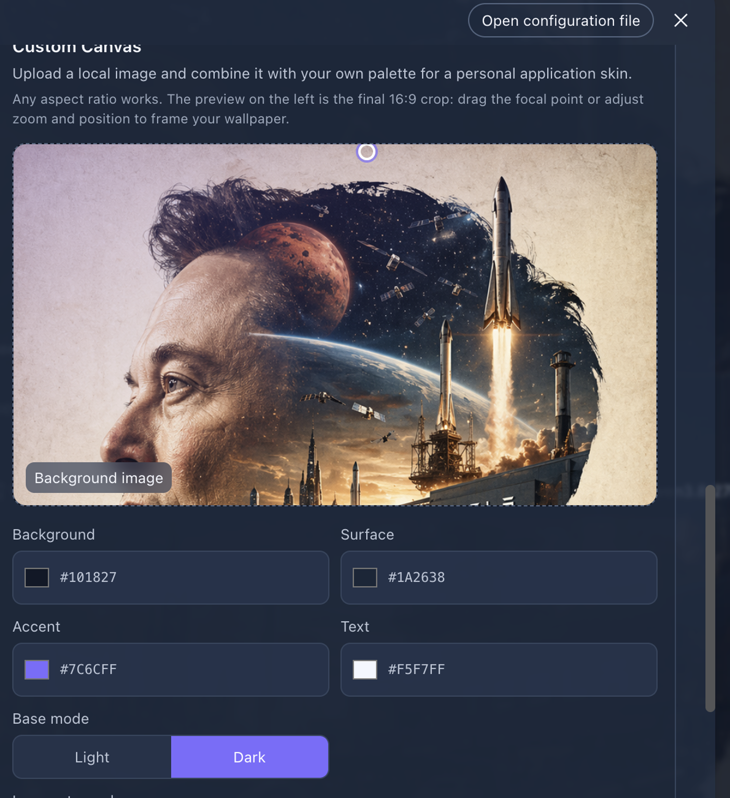

<h1 align="center">DSH Skin Studio</h1>

<p align="center">Turn DeepSeek Harness into a workspace that feels unmistakably yours.</p>

<p align="center">
  <a href="https://www.npmjs.com/package/@tobewin/dsh-skin-studio"></a>
  <a href="LICENSE"></a>
  
  
</p>

<p align="center"><a href="#quick-start">Quick start</a> · <a href="#中文">中文说明</a> · <a href="https://github.com/ToBeWin/DSH-Plugin-Market">All ToBeWin plugins</a></p>

Vibrant, switchable skins for [DeepSeek Harness](https://github.com/deepseek-ai/deepseek-harness).

DSH Skin Studio registers themes through Harness's public browser theme service. It does not fork, patch, embed, or modify DeepSeek Harness.

## See it in Harness / 应用效果

The selected wallpaper, palette, translucent surfaces, sidebar, and composer are applied together across the real Harness workspace—not just inside a settings preview.

选定的背景图、配色、半透明表面、侧边栏和输入框会共同应用到真实 Harness 工作区，而不只是显示在设置预览中。

<p align="center">
  
</p>

### Custom Canvas editor / 自定义画布编辑器

<p align="center">
  
</p>

## Included skins

- **Aurora Flow** — deep ocean and teal aurora.
- **Neon Tokyo** — cyber violet, magenta, and electric blue.
- **Sunset Coral** — warm white, coral, and amber.
- **Arctic Prism** — glacier white, indigo, and clear cyan.
- **Moonlit Ink** — ink black, ultramarine, and cool blue glow.
- **Matcha Garden** — soft leaf green, cream, and fresh mint.
- **Rose Quartz** — misty pink, amethyst, and airy rose tones.
- **Solar Flare** — deep obsidian, amber, and lava-orange glow.
- **Nordic Mist** — fog gray, warm white, and restrained blue.
- **Cobalt Tide** — deep cobalt, cyan blue, and ocean reflections.

## Custom Canvas

Alongside the included skins, **Custom Canvas** lets you create one personal, application-wide skin:

- Upload a local background image (up to 5 MB). The image is decoded before it is accepted, so an unsupported file can never appear as a misleading solid-color skin.
- Choose a light or dark base mode.
- Set the background, surface, accent, and text colors independently.
- Adjust image atmosphere so the background remains expressive without reducing readability.
- Frame each image independently: zoom, move horizontally/vertically, or drag the focus point directly in the preview. The chosen crop is retained with the skin and used in the live chat view.
- The application frame, sidebar, cards, and composer use coordinated translucent token layers, so the image remains visible in the real chat view rather than only in settings.
- Apply the combination instantly across the whole DSH interface.

The image and palette remain on this device in browser storage (IndexedDB); no image is uploaded or sent over the network.

## Quick start

```bash
dsh plugin --profile web add @tobewin/dsh-skin-studio
```

Restart DeepSeek Harness, then open **Settings → Skin Studio**. Changes apply immediately. The selection is remembered locally in the browser; choose **Default appearance** to return to the normal Harness light/dark/system preference.

## Compatibility and privacy

- Requires the current DSH Web UI theme extension point.
- Uses public `ThemeRuntime`, locale, and settings-slot APIs only.
- No network request, analytics, account access, or project-file access.
- The package stores the selected skin id in browser local storage and an optional Custom Canvas image/palette in browser IndexedDB.
- Removing or disabling the plugin unregisters all skin definitions and restores the normal Harness theme.

## Native design language

Skin Studio uses the public Harness UI primitives for its operational controls: primary actions, secondary actions, hover, focus, and disabled states all follow the currently installed Harness design system. Image framing and skin previews are the only purpose-built controls; they use the same public `--dsw-*` theme tokens and automatically follow light, dark, and custom skins.

## Development

```bash
pnpm install
pnpm check
pnpm build
```

The source tree is intentionally small: the host entry is inert, while `client/client.js` contains the public client extension.

## License

[MIT](LICENSE)

---

## 中文

这是一个为 [DeepSeek Harness](https://github.com/deepseek-ai/deepseek-harness) 提供绚丽全局皮肤的独立插件。

它只通过 Harness 公开的浏览器主题服务注册皮肤，不复制、不修改、不嵌入 Harness 源码。

### 内置皮肤

- **极光流光**：深海底色与青绿极光。
- **霓虹东京**：赛博紫、洋红与电光蓝。
- **日落珊瑚**：暖白、珊瑚与琥珀。
- **北境棱镜**：冰川白、靛蓝与清透青色。
- **月墨深蓝**：墨黑、群青与冷冽蓝光。
- **抹茶花园**：柔和草绿、奶白与清新薄荷。
- **蔷薇水晶**：雾粉、紫晶与轻盈玫瑰色。
- **日冕炽焰**：深曜石、琥珀与熔岩橙光。
- **北欧晨雾**：雾灰、暖白与克制蓝调。
- **钴蓝潮汐**：深钴蓝、青蓝与海面反光。

### 自定义画布

除内置皮肤外，「自定义画布」可以创建一套专属的全局皮肤：

- 上传本地背景图（最大 5 MB）。图片会先完成解码验证；不支持的文件不会再以“已上传但只有纯色”的状态被接受。
- 选择浅色或深色基底。
- 分别调整背景、表面、强调与文字颜色。
- 调整图片氛围强度，在图片表现力与内容可读性之间平衡。
- 为每张图片单独取景：缩放、横向/纵向移动，或直接在预览里拖动焦点。取景参数会和皮肤一同保存，并应用到实际聊天页。
- 应用主框架、侧栏、卡片与输入区会协调使用半透明主题层，因此图片会在实际聊天页可见，而不只是设置页预览。
- 将图片和配色组合，即时应用到整个 DSH 界面。

图片与配色只保存在本机浏览器的 IndexedDB 中，不会上传或发送到网络。

### 安装与使用

```bash
dsh plugin --profile web add @tobewin/dsh-skin-studio
```

重启 DeepSeek Harness 后，在 **设置 → 皮肤工作室** 中选择即可即时生效。选择会保存在浏览器本地；点击「默认外观」即可恢复 Harness 原有的浅色、深色或跟随系统设置。

### 隐私与解耦

- 只依赖 DSH 的公开 ThemeRuntime、语言和设置插槽接口。
- 不访问网络、账号、会话内容或项目文件。
- 浏览器本地保存当前皮肤 ID；可选的自定义图片与配色存放在 IndexedDB。
- 停用或卸载插件后会自动注销皮肤并恢复 Harness 默认主题。

### 原生设计语言

皮肤工作室的操作按钮直接复用 Harness 公开的 UI primitives：主操作、次级操作、悬停、焦点与禁用状态都会跟随当前安装的 Harness 设计系统。图片取景和皮肤预览属于新增能力，因此仅为这两类控件编写最小的专用界面；它们同样只使用公开的 `--dsw-*` 主题 token，并自动适配浅色、深色和自定义皮肤。
